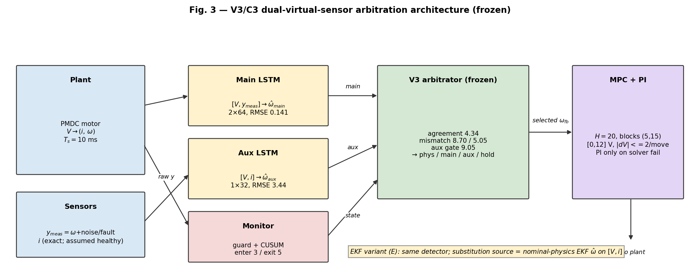

# Reliability-Aware LSTM-MPC for Sensor-Fault-Tolerant DC Motor Control

> Research code, frozen experimental evidence, robustness studies, and a preregistered follow-up for fault-tolerant control of a simulated permanent-magnet DC motor.

This repository investigates a practical failure mode of learned model-predictive control (MPC): **what happens when the speed sensor feeding an LSTM-MPC becomes biased, noisy, drifting, or unavailable?**

The project combines:

- a nonlinear DC-motor simulator,
- a residual LSTM plant model,
- constrained nonlinear MPC,
- residual/CUSUM reliability monitoring,
- virtual feedback substitution,
- an independent current-fed auxiliary LSTM,
- an augmented-state extended Kalman filter (EKF),
- training-seed and fault-severity robustness studies, and
- a preregistered V4 detector study.

The main scientific conclusion is intentionally bounded: the frozen V3 controller provides strong protection against several abrupt speed-sensor faults in simulation, but it also exposes important limitations—especially false reliability latching under plant/load mismatch, weak drift detection, training-seed sensitivity in combined fault-plus-load conditions, and computation that is not yet reliably real-time at a 20 Hz control rate.

**Current status:** V3, the training-seed study, the EKF comparator, and the final robustness/severity study are complete and preserved. The C4 three-way attribution extension was stopped at **NO-GO**. A V4 detector study has been **preregistered**, but its confirmatory matrix is still pending.

<p align="center">
  
</p>

---

## Research question

Can a learned residual monitor detect a corrupted motor-speed sensor and safely substitute virtual feedback **without confusing genuine sensor faults with normal transients, load disturbances, or model mismatch?**

The repository approaches that question in stages:

1. simulate and validate a nonlinear permanent-magnet DC motor;
2. generate trajectory data and train an LSTM predictor;
3. embed the learned model inside constrained MPC;
4. detect suspect speed measurements using an instantaneous residual gate plus two-sided CUSUM;
5. substitute learned virtual feedback when the physical speed sensor is considered unreliable;
6. add an independent auxiliary LSTM using voltage and armature current;
7. introduce dual-virtual-sensor arbitration;
8. compare with an augmented-state EKF and other classical observer/plausibility baselines;
9. measure sensitivity to training seeds, simulation seeds, fault severity, load disturbance, and current-channel corruption;
10. preregister V4 detector fixes before running new confirmatory evidence.

---

## System architecture

The plant advances at **10 ms**, while the controller updates every **50 ms**.

```text
 reference
    |
    v
+----------------------+         voltage        +----------------------+
| constrained LSTM-MPC |----------------------->| nonlinear DC motor   |
+----------------------+                        | + load disturbance    |
           ^                                    +----------------------+
           |                                        |              |
           |                                      speed          current
           |                                        |              |
           |                                        v              v
           |                                +---------------+   +----------------+
           +--------------------------------| feedback      |<--| independent    |
                                            | selector      |   | witnesses      |
                                            +---------------+   | aux LSTM / EKF |
                                                   ^            +----------------+
                                                   |
                                            +---------------+
                                            | reliability   |
                                            | monitor       |
                                            | residual+CUSUM|
                                            +---------------+
                                                   ^
                                                   |
                                             main LSTM
```

### Main components

| Component | Implementation | Purpose |
|---|---|---|
| Nonlinear motor | `project/src/motor_model.py` | RK4 DC-motor dynamics with viscous + smoothed Coulomb friction and load torque |
| Main learned model | `project/src/lstm_model.py` | 2-layer residual LSTM using a 20-sample `[voltage, speed]` history |
| MPC | `project/src/mpc.py` | Constrained nonlinear LSTM-MPC with SLSQP, warm start, voltage and slew limits |
| Reliability monitor | `project/src/reliability.py` | Instantaneous residual gate + two-sided CUSUM + persistence/hysteresis |
| Auxiliary virtual sensor | `project/src/auxiliary_sensor_model.py` | LSTM using only `[voltage, armature current]` |
| EKF observer | `project/src/ekf_observer.py` | Augmented `[current, speed, load torque]` EKF using voltage and current |
| V4 monitor | `project/src/reliability_v4.py` | Preregistered detector changes for startup, CUSUM windup, witness gating, and recovery |
| Classical baselines | `project/src/baselines_v4.py` | EKF/CUSUM, fixed-gate, median/rate, and observer-based reference methods |

---

## Main LSTM evidence

The frozen seed-2026 main predictor uses two LSTM layers, hidden size 64, dropout 0.2, a 20-sample history, and residual prediction.

| Metric | Frozen result |
|---|---:|
| Held-out one-step RMSE | **0.140873 rad/s** |
| Held-out MAE | **0.113106 rad/s** |
| Held-out R² | **0.999906** |
| Persistence-baseline RMSE | **0.289778 rad/s** |
| Recursive endpoint RMSE, H=5 | **0.210952 rad/s** |
| Recursive endpoint RMSE, H=10 | **0.336461 rad/s** |
| Recursive endpoint RMSE, H=15 | **0.487796 rad/s** |

The one-step predictor is accurate on the frozen test set, but recursive error grows with horizon. The project therefore treats one-step accuracy as necessary—not sufficient—for robust closed-loop substitution.

---

## Frozen V3 closed-loop study

The completed V3 holdout contains **275 paired runs**:

```text
5 controllers × 11 scenarios × 5 untouched evaluation seeds
```

Relative to plain LSTM-MPC, the protected C3 controller reduced mean fault-window RMSE by approximately:

| Fault | C3 improvement vs plain MPC |
|---|---:|
| 5% speed bias | **87.2%** |
| 15% speed bias | **95.4%** |
| Speed dropout | **98.2%** |
| Sensor noise | **42.6%** |
| Gradual drift | **no meaningful benefit** |

The most important negative result is the **load-disturbance failure mode**. With a healthy speed sensor, model/plant mismatch can accumulate enough residual evidence to trigger a false sensor-fault latch. Mean load-disturbance RMSE increased from about **0.937 rad/s** for plain MPC to **2.539 rad/s** for C3.

Across the frozen V3 matrix, the saved evidence reports:

- **0 optimizer failures**
- **0 non-finite events**
- **0 voltage violations**
- **0 slew violations**

The V3 verifier reconstructs the frozen calibration and checks the saved results and provenance.

---

## Training-seed robustness

The project later repeated the main/auxiliary training pipeline for seeds **2026, 2027, and 2028** while keeping the dataset, split, architectures, training rules, calibration procedures, controllers, scenarios, and paired simulation seeds fixed.

Key outcome:

- speed dropout remained favorable across all tested training seeds;
- 5% speed bias remained favorable on average across all three;
- combined sensor-fault + load behavior changed sign across trained model pairs.

The preregistered verdict is therefore:

> **TRAINING-SEED-SENSITIVE**

The repository deliberately preserves this result instead of selecting the most favorable trained instance.

---

## Final robustness and severity study

The closed robustness study contains **735 labeled Part-B rows** plus the earlier frozen Part-A training/simulation-seed analysis.

The final verifier reports:

- 43/43 historical protected artifacts unchanged;
- 600 primary robustness runs;
- 135 current-channel boundary runs;
- 0 optimizer failures;
- 0 main-prediction failures;
- 0 auxiliary-prediction failures;
- 0 EKF numerical failures;
- 0 non-finite events;
- 0 voltage violations;
- 0 slew violations;
- 0 incomplete runs.

The final operating-envelope classification is intentionally conservative:

- **0 SUPPORTED**
- **11 LIMITED**
- **5 UNSUPPORTED**

Abrupt bias/dropout tracking is favorable in important tested regions, but drift, load-induced false entries, combined-fault sensitivity, and current-channel assumptions remain open limitations.

---

## Research evolution

| Stage | Status | Outcome |
|---|---|---|
| V1 | Complete / frozen | Established the original reliability-aware LSTM-MPC sensor-fault result |
| V2 | Complete | Added an independent current-fed auxiliary virtual sensor |
| V3 / C3 | **Frozen strongest completed learned architecture** | Dual-virtual-sensor arbitration; strong abrupt-fault results with known load/disturbance limitations |
| C2 ablation | Closed negative result | Auxiliary recovery gate was uniquely binding 0 times |
| C4-v1 | **NO-GO** | Three-way scalar consistency attribution was numerically identical to C3 over the 105-run development matrix and did not solve load false entries |
| EKF study | Complete / baseline role | Useful classical current-fed comparator; retained as a baseline rather than a successor |
| Training-seed study | Complete | Abrupt dropout robust across tested seeds; combined fault + load is training-seed-sensitive |
| Final robustness/severity | **CLOSED_VERIFIED** | Severity, load, seed, and current-channel boundaries quantified |
| V4 | **Preregistered; confirmatory results pending** | Tests startup gating, CUSUM anti-windup, witness agreement, bounded recovery, and classical baselines |

---

## C4 result: why the three-way attribution idea was stopped

C4 introduced pairwise consistency checks between:

```text
physical sensor
main LSTM
auxiliary LSTM
```

using the distances

```text
d_sm = |sensor - main|
d_sa = |sensor - auxiliary|
d_ma = |main - auxiliary|
```

The intended idea was to distinguish:

- a bad physical sensor,
- a main-model/plant mismatch,
- an auxiliary-model mismatch.

In the frozen 105-run development matrix, however:

- C4 and C3 were numerically identical;
- the intended `LIKELY_PLANT_OR_MAIN_MISMATCH` state was never reached;
- load false-entry reduction was 0%;
- tracking-penalty reduction was 0%;
- genuine-fault suppression was 0%;
- the predeclared stage gate returned **NO-GO**.

The follow-up analysis showed that the false entries were primarily caused by **temporal CUSUM accumulation**, while the instantaneous three-scalar geometry at the actual latch sample usually did not contain the hypothesized causal signature. That motivated the later V4 focus on detector dynamics rather than another three-distance classifier.

---

## EKF observer study

The EKF uses the augmented state

```text
[current, angular speed, load torque]
```

and consumes only:

- applied voltage,
- measured armature current.

It does **not** use the speed sensor as an online observer input.

The EKF was evaluated as a classical comparator and independent witness. It performs strongly on isolated abrupt sensor faults but was retained as **BASELINE_ONLY**, because it did not consistently improve combined fault+load and load-disturbance behavior under the frozen successor criteria.

---

## Repository structure

```text
cs_novelty/
├── README.md                         # repository overview
└── project/
    ├── README.md                     # detailed original/frozen evidence summary
    ├── requirements.txt
    │
    ├── src/
    │   ├── motor_model.py
    │   ├── data_utils.py
    │   ├── lstm_model.py
    │   ├── auxiliary_sensor_model.py
    │   ├── mpc.py
    │   ├── reliability.py
    │   ├── reliability_v4.py
    │   ├── ekf_observer.py
    │   └── baselines_v4.py
    │
    ├── scripts/                      # training, calibration, evaluation, analysis, verification
    ├── tests/                        # regression, provenance, V4 and verifier tests
    ├── notebooks/                    # original notebook-based research pipeline
    ├── data/processed/               # processed trajectory dataset
    ├── models/                       # additional training-seed checkpoints
    │
    ├── results/
    │   ├── configs/                  # frozen controller/calibration configurations
    │   ├── metrics/                  # V1/V2/V3/C4/EKF evidence
    │   ├── raw/                      # representative traces / arrays
    │   ├── plots/                    # diagnostic plots
    │   ├── training_seed_robustness/
    │   ├── final_robustness/
    │   └── v4/                       # preregistration + V4 preparation artifacts
    │
    ├── paper/                        # IEEE-style manuscript, figures and tables
    │
    ├── PROJECT_PIPELINE_AND_STATUS.md
    ├── V3_DUAL_VIRTUAL_SENSOR_EXTENSION.md
    ├── NEXT_RESEARCH_ARCHITECTURE_PLAN.md
    ├── EKF_OBSERVER_PREREGISTRATION.md
    ├── TRAINING_SEED_ROBUSTNESS.md
    ├── FINAL_ROBUSTNESS_AND_SEVERITY_STUDY.md
    └── V4_PREREGISTRATION.md
```

---

## Quick start

The current dependency set is pinned in `project/requirements.txt`.

```bash
git clone https://github.com/lakshyalalan2810/cs_novelty.git
cd cs_novelty/project

python -m venv .venv
```

### Windows / PowerShell

```powershell
.\.venv\Scripts\Activate.ps1
python -m pip install --upgrade pip
pip install -r requirements.txt
```

### Linux / macOS

```bash
source .venv/bin/activate
python -m pip install --upgrade pip
pip install -r requirements.txt
```

---

## Original notebook pipeline

The original research path is preserved as sequential notebooks:

```text
01_dc_motor_simulation.ipynb
02_dataset_generation.ipynb
03_lstm_training.ipynb
04_reliability_analysis.ipynb
04b_reliability_redesign.ipynb
04c_reliability_finalization.ipynb
04d_auxiliary_virtual_sensor.ipynb
04e_dual_virtual_sensor_arbitration.ipynb
05_mpc_experiments.ipynb
06_final_evaluation.ipynb
```

Later V3/C4/EKF/robustness/V4 work is primarily script-driven so that protocols, seeds, calibration rules, hashes, and verification logic are easier to freeze and audit.

---

## Verify saved evidence

Run these from `project/`:

```bash
python scripts/verify_results.py
python scripts/verify_v3_results.py
python scripts/verify_ekf_results.py
python scripts/verify_training_seed_robustness.py
python scripts/verify_final_robustness_study.py
```

There is also:

```bash
python scripts/run_all_verifiers.py
```

At the current repository state, the bare C4 final-stage check intentionally remains fail-loud because C4-v1 stopped at **NO-GO** and no C4 final-holdout artifacts were created. That status is documented in:

```text
project/results/v4/phase9/c4_verifier_status_note.md
```

Missing scientific evidence must not be fabricated merely to make a global verification runner green.

---

## Important documents

For the shortest path through the project:

- **`project/PROJECT_PIPELINE_AND_STATUS.md`** — original pipeline and frozen V1/V3 status.
- **`project/V3_DUAL_VIRTUAL_SENSOR_EXTENSION.md`** — V3 architecture and final evidence.
- **`project/NEXT_RESEARCH_ARCHITECTURE_PLAN.md`** — why C4 was stopped and why a classical observer was introduced.
- **`project/EKF_OBSERVER_PREREGISTRATION.md`** — EKF protocol and evaluation role.
- **`project/TRAINING_SEED_ROBUSTNESS.md`** — matched retraining study across three model seeds.
- **`project/FINAL_ROBUSTNESS_AND_SEVERITY_STUDY.md`** — final V3 robustness/severity closeout.
- **`project/V4_PREREGISTRATION.md`** — frozen V4 confirmatory design.
- **`project/paper/main.tex`** — work-in-progress IEEE manuscript.

---

## V4: current research direction

The current manuscript is titled:

> **Reliability-Aware LSTM-MPC With Dual Witnesses for Sensor-Fault-Tolerant DC-Motor Control: A Preregistered Evaluation**

V4 is designed to address specific failure modes identified from the frozen studies rather than retuning V3 after seeing holdout results.

Its primary changes are:

- CUSUM anti-windup/clamping;
- startup warmup with physical-sensor trust;
- an independent witness-agreement rule using either the auxiliary LSTM or EKF;
- bounded recovery/discharge behavior;
- classical baselines with their own independent detection/substitution logic;
- fresh startup-rich data;
- 11 training seeds;
- fresh confirmatory simulation-seed blocks;
- nine preregistered hypotheses with Holm correction.

**The V4 confirmatory results are still pending.** No V4 performance claim should be treated as established until the frozen protocol has been executed and analyzed.

---

## Scope and limitations

This is a **simulation research repository**, not a production motor-drive controller.

Current limitations include:

- no hardware-in-the-loop or physical-motor validation;
- the original MPC implementation is not reliably real-time at the 50 ms update period on the reference machine;
- gradual drift remains difficult for the frozen detector;
- load and plant mismatch can trigger false sensor-fault entries;
- the auxiliary LSTM and EKF depend on the armature-current channel, so the repository does not establish simultaneous multi-sensor-failure tolerance;
- combined sensor fault + load performance is sensitive to trained-model realization;
- current evidence does not establish universal fault isolation, certified stability, or universal superiority over classical control/observer methods.

These negative results are deliberately retained as part of the research record.

---

## Reproducibility philosophy

The project increasingly follows a:

```text
freeze → evaluate → verify
```

workflow.

That means:

- training and calibration procedures are fixed before holdout evaluation;
- development and final seed blocks are separated;
- calibration uses validation evidence rather than final fault outcomes;
- model/config/source hashes are stored alongside study artifacts;
- failed hypotheses and NO-GO stages are preserved;
- final tables are reconstructed from machine-readable CSV/JSON evidence;
- verifier scripts fail loudly on missing or inconsistent artifacts.

The repository is therefore both an LSTM-MPC implementation and a study in how to evaluate learned fault-tolerant control without hiding model-seed sensitivity or detector failure modes.

---

## Publication status

The IEEE manuscript under `project/paper/` is still under development.

V4 confirmatory results and parts of the related-work/citation section remain pending, so the paper should not yet be treated as a completed publication.

For exact frozen numerical evidence, use the reports and machine-readable artifacts under `project/results/`.
